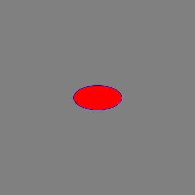

# Color

Similar to many other graphics programs, can specify color in Processing with
red, green, and blue (RGB) values.

`(255, 0, 0)` -> red   
`(0, 255, 0)` -> green  
`(0, 0, 255)` -> blue  
`(0, 0, 0)` -> black  
`(255, 255, 255)` -> white  

The Processing Development Environment includes a color selector (menu: File /
Color Selector), or you can use any other color selector (Photoshop, Google) to
obtain RGB values for the color you want.

If you specify a single value, it is used for all three color channels, so
```
background(0);
```
is the same as:
```
background(0, 0, 0);
```

Here's an example that changes the background color to grey
(`background(128)`), the fill color of the ellipse to red (`fill(255, 0, 0)`),
and the border color to blue (`stroke(0, 0, 255)`).

```java
size(400, 400);
background(128);
fill(255, 0, 0);
stroke(0, 0, 255);
ellipse(200, 200, 100, 50);
```



