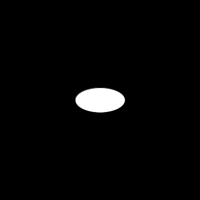

# Hello Processing

Here is a first program in Processing.

```java
size(400, 400);
background(0);
ellipse(200, 200, 100, 50);
```



The `size(400, 400)` statement creates a window that is 400 by 400 pixels in
size.  This gives us an xy-coordinate system where the y-values grow downwards.
The origin (0,0) is the upper left corner of the screen.  The point (400, 0) is
the upper right corner.  The point (0, 400) is the lower left corner.  And the
point (400, 400) iks the lower right corner.

The `background(0)` statement clears the background to black (you'll learn more
about color next).

The `ellipse(200, 200, 100, 50)` statement draws an ellipse at 
position (200, 200), width 100, and height 50.

